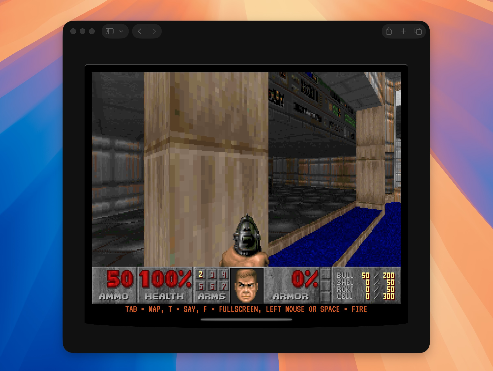
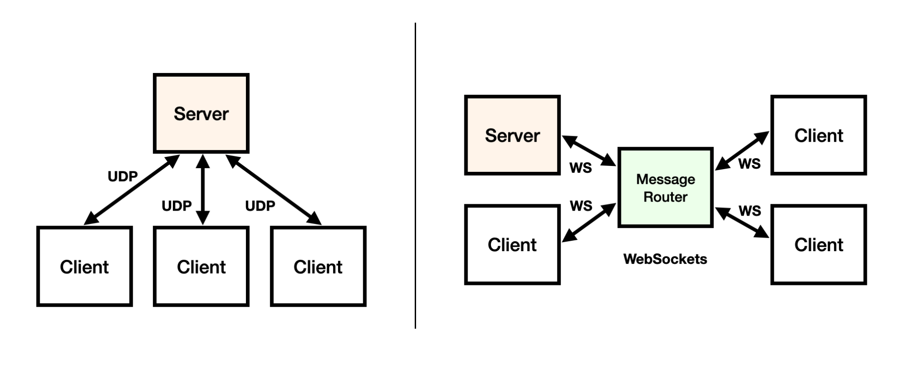
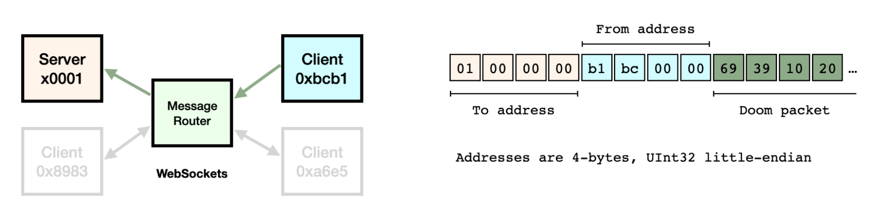

# Cloudflare Agentic Doom

Cloudflare Agentic Doom is an improved follow-up to the [Doom on Workers](https://blog.cloudflare.com/doom-multiplayer-workers/) project, showcasing how you can use the [Developer Platform](https://workers.cloudflare.com/) products for online real-time multi-client coordination using Doom as an example.



## Changelog and features

Features and changelog since the [initial](https://blog.cloudflare.com/doom-multiplayer-workers/) version:

- Updated to the latest [Chocolate Doom](https://github.com/chocolate-doom/chocolate-doom) 3.1.1. 🆕
  - Patched to support [networking over WebSocket](doom/src/net_websockets.c), the [stdout](README.md#stdout-procotol) protocol and extra CLI parameters.
  - Compiled to Wasm using [emsdk](https://emscripten.org/docs/tools_reference/emsdk.html). 🆕
- Updated the project to a single-repo and to use [Workers Assets](https://developers.cloudflare.com/workers/static-assets/).
  - Migrated the web app to [React](src/app) and [@cloudflare/vite-plugin](https://developers.cloudflare.com/workers/vite-plugin/). 🆕
- Added local dev support. 🆕
- Multiple [IWAD](https://doomwiki.org/wiki/IWAD) map files support, local and [remote](https://github.com/cloudflare/doom/blob/agentic-doom/src/lib/common.ts). 🆕
- Fixed a Wasm OPL music [deadlock](doom/opl/opl.c) and added music support. 🎸 🆕
- Over-the-Internet multiplayer support using WebSocket TCP connections and a Durable Object for communication and routing between clients.
  - Durable Object router: migrated away from fetch to [invoke RPC methods](https://developers.cloudflare.com/durable-objects/best-practices/create-durable-object-stubs-and-send-requests/#invoke-rpc-methods). 🆕
- Uses Workers AI [Text-to-Spech models](https://developers.cloudflare.com/workers-ai/models/?tasks=Text-to-Speech) to "speak" the multi-player and system game messages. 💬 🆕

## Running locally and deploying

Agentic Doom now supports running locally end to end, including multi-player.

Before you start, copy `.dev.vars.sample` to `.dev.vars`. Then:

```
npm install
npm run dev
```

Once it's running just point multiple browser windows at http://localhost:1234/ (change port to what wrangler outputs) and enjoy.

To deploy to Cloudflare type `make deploy-production`. Change `CLOUDFLARE_ACCOUNT_ID` in `.dev.vars` to match your account id.

## Compiling Doom

The patched version of Chocolate Doom we use can be found at [./doom/src](doom/src). You can add your own changes to the code and recompile Doom.We added a few utility scripts to the root Makefile to clean and compile the Doom sources and to copy the Wasm builds to the Worker project:

```
❯ make
Available Targets:

  ...
  doom-build:        Build Chocolate Doom (Emscripten/WASM) into doom/src/
  doom-copy:         Copy chocolate-doom.* artifacts from doom/src/ into ./public
  doom-clean:        Remove doom/build and in-tree doom browser bundles
```
You need install Emscripten [emsdk](https://emscripten.org/docs/getting_started/downloads.html) before compiling Doom.

## Multiplayer protocol

The original MS-DOS Doom used the IPX networking protocol from Novell NetWare for multiplayer. Later versions and current ports migrated to UDP (though some still maintain compatibility with IPX, because why not?).

There's a good reason why action games use UDP (instead of TCP) for their multiplayer protocols. UDP is simple, fast, and non-blocking. However, you need to deal with packet loss or out-of-order packets at the application level. You're basically trading responsiveness, low latency, and speed for guarantees and reliability.

Lets look at how the original Doom does network multiplayer and how we are doing it on top of Cloudflare Workers.



**On the left** is how the original Doom workers. You can see the server (the one who starts the game) and the other three players who connect to the server via UDP. If you wanted to play Doom over the Internet, you'd have to make sure all players had public IP addresses and specific firewall and forwarding rules configured. Chocolate Doom even has some [hole punching](https://en.wikipedia.org/wiki/Hole_punching_(networking)) code in it. We don't want to deal with any of this.

**On the right**, in our case, we want everything to be Web-based and zero-config, so all of the four players connect to a single WebSockets server that acts as a message router between the group.

Here's a more detailed diagram of our implementation.



Lets look at how this works both from the Doom and the router perspectives.

### Doom net_websocket.c

We won’t have IP addresses anymore, just a WebSocket connection to which we need to tunnel our UDP-based point-to-point protocol through.

To emulate the standard behaviour we create a fake IP at [startup](doom/src/d_loop.c#L481), just a random uint32_t number, and we add ourselves and the other clients we discover in the WebSocket protocol and have to talk to, to an internal routing table.

```c
    if (M_CheckParm("-server") > 0
     || M_CheckParm("-privateserver") > 0)
    {
        instanceUID = 1;
        ...
    }
    else
    {
        srand((unsigned int)time(NULL));
        instanceUID = rand() % 0xfffe;
        ...
    }
```

Next, to avoid blocking Doom because we're not using UDP, we created an intermediate queue between the asynchronous WebSockets layer and the internal Doom routines to act as a buffer and alleviate the fact that we are using TCP. This worked nicely.

```c
static void WebsocketsQueuePush(
  packet_queue_t *queue,
  net_packet_t *packet,
  uint32_t from)
{
    int new_tail;

    new_tail = (queue->tail + 1) % MAX_QUEUE_SIZE;

    if (new_tail == queue->head) {
        // queue is full
        return;
    }

    queue->packets[queue->tail] = packet;
    queue->froms[queue->tail] = from;
    queue->tail = new_tail;
}
```

This queue is then fed every time we receive a new WebSockets packet, asynchronously, outside the game main loop and logic.

```c
EM_BOOL WebSocketMessage(
  int eventType,
  const EmscriptenWebSocketMessageEvent *e,
  void *userData)
{
    net_packet_t *packet;
    uint32_t ip = 0;

    packet = NET_NewPacket(e->numBytes - 4);
    memcpy(packet->data, &e->data[4], e->numBytes - 4);
    packet->len = e->numBytes - 4;

    ip = ip | *(&e->data[3]) << 24;
    ip = ip | *(&e->data[2]) << 16;
    ip = ip | *(&e->data[1]) << 8;
    ip = ip | *(&e->data[0]);

    WebsocketsQueuePush(&client_queue, packet, ip);

    return 0;
}
```

And then, when the main game loop asks for newly received packets as part of its “main loop”, we’re now able to instantly return everything we see in our queue, close to how UDP would behave.

```c
static boolean NET_Websockets_RecvPacket(
  net_addr_t **addr,
  net_packet_t **packet)
{
    ws_packet_t *popped;

    if (InitWebSockets() == false) return false;

    while ((popped = WebsocketsQueuePop(&client_queue)) != NULL) {
        if (popped->packet->len >= 5&& memcmp(popped->packet->data, "doom:", 5) == 0) {
            printf("%.*s\n", (int)popped->packet->len, (char *)popped->packet->data);
            NET_FreePacket(popped->packet);
            continue;
        }
        *packet = popped->packet;
        *addr = FindAddressByIp((*(uint32_t *)(popped->from)));
        return true;
    }

    return false;
}
```

Finally we use [emscripten_websocket_send_binary()](https://emscripten.org/docs/porting/networking.html#emscripten-websockets-api)'s passthrough API to send the traffic out. The messages are sent through the WebSocket using a simple envelope that contains the “From” and the “To” fake IPs, 4 bytes each (UInt32 little-endian), and the original packet from the Doom protocol.

```c
static void NET_Websockets_SendPacket(net_addr_t *addr, net_packet_t *packet)
{
    char *wspacket;
    int r;

    if (InitWebSockets() == false) return;
    wspacket = malloc(packet->len + 8);

    if (addr->handle) {
        to_ip = (*(uint32_t *)(addr->handle));
        memcpy(&wspacket[0], &to_ip, 4);       // to
        memcpy(&wspacket[4], &instanceUID, 4); // from
        memcpy(&wspacket[8], packet->data, packet->len);
        r = emscripten_websocket_send_binary(websocket, wspacket, packet->len + 8);
        if (r < 0) {
            printf("doom: 6, failed to send ws packet, reconnecting");
            inittedWebSockets = false;
        }
        free(wspacket);
    }
}
```

### Message router

The message router runs on Cloudflare Workers [Durable Object](https://developers.cloudflare.com/durable-objects/) and handles the following:

- Accept WebSocket connections from Doom clients.
- Build a routing table that maps a connection to a “From” address.
- Receive and parse the incoming messages and broadcasts the messages back to the corresponding clients.
- Handle some REST APIs to create and validate Doom rooms (game sessions), download IWADs, etc.

The message router source code can be found at [src/worker/](src/worker/index.ts).

## stdout procotol

To interface with game while it's running we send the following formatted stdout messages, which are them [parsed](src/app/components/DoomPrintHandler.tsxdist/) in the web app running Doom Wasm:

```
doom: 1, failed to connect to websockets server
doom: 2, connected to %s
doom: 3, we're out of client addresses
doom: 4, ws error(eventType=%d, userData=%d)
doom: 5, ws close(eventType=%d, wasClean=%d, code=%d, reason=%s, userData=%d)
doom: 6, failed to send ws packet, reconnecting
doom: 7, failed to connect to %s
doom: 8, uid is %d
doom: 9, disconnected from server
doom: 10, game started
doom: 11, entering fullscreen
doom: 12, client '%s' timed out and disconnected
doom: 13, host disconnected
doom: 14, {player name}, {text message}
doom: 15, {system message}
```

## Third-party Assets

### DOOM1.WAD

This project bundles `public/doom1.wad`, the shareware Doom IWAD from id Software.
See the Doom Wiki page for details: https://doomwiki.org/wiki/DOOM1.WAD

`DOOM1.WAD` is the shareware version of the original Doom IWAD. It contains the
first episode, "Knee-Deep in the Dead", and is © id Software / ZeniMax / Microsoft.
The shareware WAD is freely distributable for non-commercial use under the original
shareware terms. It is **not** released under the same license as this project's
source code (see `LICENSE`) and remains the property of its respective copyright
holders. Commercial redistribution is prohibited without permission from id Software.

The Doom source code itself was released by id Software under the GNU GPL in 1999,
but this license does **not** cover the WAD data files.

### Chocolate Doom

This project bundles `doom`, a patched version of the [Chocolate Doom](https://www.chocolate-doom.org/) engine, and the WebAssembly compiled builds `public/chocolate-doom.js` and `public/chocolate-doom.wasm`. Chocolate Doom is licensed under the GNU General Public License, version 2 or later (GPL-2.0-or-later). See https://github.com/chocolate-doom/chocolate-doom for source and license details.

